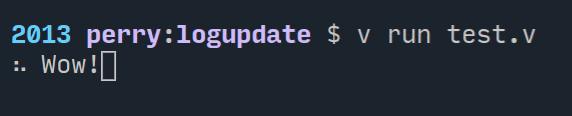

# logupdate
> Single-line log updater for vlang

[](https://travis-ci.org/perry-mitchell/logupdate)

Update the current terminal line by overwriting it - useful for displaying progress bars/animations while some work is done.



## Installation

Install using vpm:

```shell
v install perry_mitchell.logupdate
```

## Usage

Usage is very simple - `update` simply updates the same line over and over:

```v
import logupdate
import time

fn main() {
    mut val := 0
	for {
		val = val + 1
		if val > 9 {
			val = 1
		}
		logupdate.update("Counter: $val")
		time.sleep_ms(200)
	}
}
```

Use `clear` to clear the update by setting one final value to the line (writes a new-line as well).

## Testing

Simply run `make all`.
